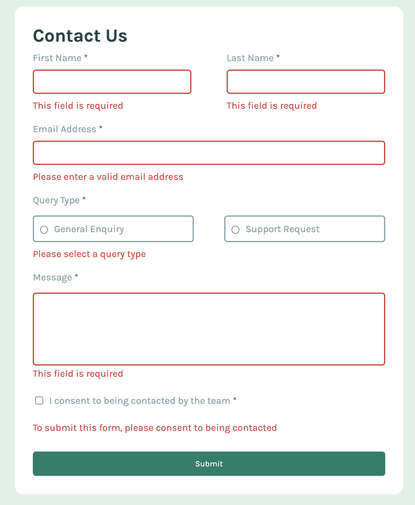

# Frontend Mentor - Contact form solution

This is a solution to the [Contact form challenge on Frontend Mentor](https://www.frontendmentor.io/challenges/contact-form--G-hYlqKJj). Frontend Mentor challenges help you improve your coding skills by building realistic projects. 

# 📩 Contact Form

## 📌 Description
This project is a responsive contact form with client-side validation.  
It allows users to submit their details and message while ensuring all inputs meet validation requirements before submission.

## 🚀 Features
- Form validation (required fields, email format)
- Real-time error messages
- Success state after submission
- Accessible form inputs
- Fully responsive design

## 🖥️ Demo

- Repository: https://github.com/yourusername/contact-form

---

## ⚙️ How it works

### ✅ Validation
Each input field is validated before submission:
- Empty fields → error message
- Invalid email → format validation
- Required checkbox → must be selected

### 💬 User Feedback
- Errors are displayed dynamically under inputs  
- On successful submission → success message is shown  

---

## 🛠️ Tech Stack
- HTML5
- CSS3 (Flexbox, Grid)
- JavaScript (Vanilla)

---

## 🧠 What I learned
- Form validation in JavaScript
- Handling user input and events
- Displaying dynamic error messages
- Improving UX with feedback states
- Writing cleaner and reusable validation logic

---

## 🔄 Future improvements
- Backend integration (e.g. sending emails)
- Better accessibility (ARIA attributes)
- Input sanitization
- Dark mode

---

## 👤 Author
- GitHub: https://github.com/MajloszIS
- Frontend Mentor: https://www.frontendmentor.io/profile/MajloszIS